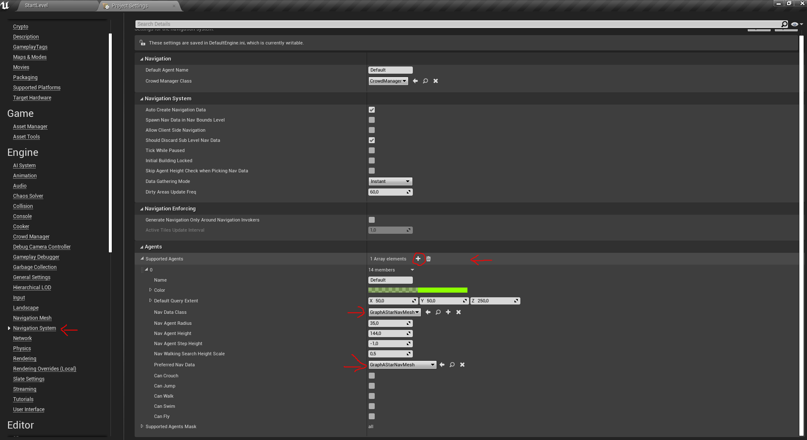
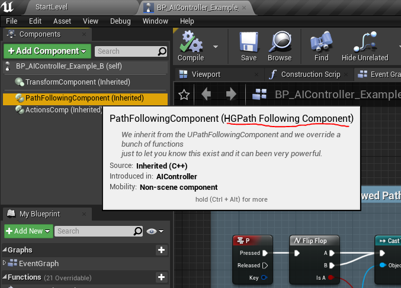
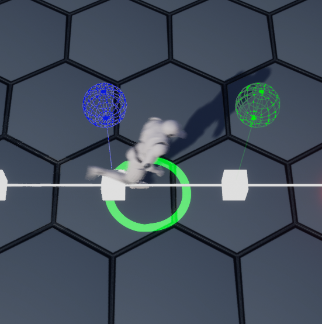

## This is the "stable" release branch, look at the [master branch](https://github.com/ZioYuri78/GraphAStarExample/tree/Master) for advanced features like:
* Hex Grid Plugin (basic version)
* Simple jump implementation
* EQS support
* Simple A* debug draws
* Simple avoidance


# Hexagonal grid pathfinding in Unreal Engine 4

## Prerequisites
* [A good knowledge of C++.](https://www.learncpp.com/)
* Red Blob Games articles about hexagonal grid.
  * [Hexagonal grid reference.](https://www.redblobgames.com/grids/hexagons/)
  * [Hexagonal grid implementation guide.](https://www.redblobgames.com/grids/hexagons/implementation.html)
  
## Readings will let you better understand my example project
* [Epic wiki article about replacing the pathfinder.](https://www.ue4community.wiki/Legacy/Replacing_The_Pathfinder)
* [Neatly replacing NavMesh with A* in UE4 by Chris Russel.](https://crussel.net/2016/06/05/neatly-replacing-navmesh-with-a-in-ue4/)
* [Epic wiki article about custom Path Following Component.](https://www.ue4community.wiki/Legacy/AI_Navigation_in_C%2B%2B,_Customize_Path_Following_Every_Tick)

## The GraphAStarExample project


Welcome all to my example project about how to use the Unreal Engine 4 generic graph A* implementation with hexagonal grids, the intent of this project is to guide you on what you need to setup the basics for navigation on hexagonal grids, this is not a complete tutorial but more like a guideline and doesn't cover topics like avoidance, grid transfer etc.

In the project you will find two examples, A and B, both examples work with the same Pathfinder, Example B is just a bonus that will show you what you can do with a custom PathFollowingComponent.

### Table of contents
- [Classes and structs you need to know.](https://github.com/ZioYuri78/GraphAStarExample#classes-and-structs-you-need-to-know)
- [Classes and structs we used in the project.](https://github.com/ZioYuri78/GraphAStarExample#classes-and-structs-we-used-in-the-project)
- [Core Blueprints of the project.](https://github.com/ZioYuri78/GraphAStarExample#core-blueprints-of-the-project)

### Classes and Structs you need to know
- [ANavigationData](https://github.com/ZioYuri78/GraphAStarExample#anavigationdata)
- [ARecastNavMesh](https://github.com/ZioYuri78/GraphAStarExample#arecastnavmesh)
- [FGraphAStar](https://github.com/ZioYuri78/GraphAStarExample#fgraphastar)
- [AAIController (optional)](https://github.com/ZioYuri78/GraphAStarExample#aaicontroller-optional)
- [UPathFollowingComponent (optional)](https://github.com/ZioYuri78/GraphAStarExample#upathfollowingcomponent-optional)

#### ANavigationData
Represents abstract Navigation Data (sub-classed as NavMesh, NavGraph, etc).
Used as a common interface for all navigation types handled by NavigationSystem.

Here you will find a lot of interesting stuff but the most important for us is the FindPathImplementation class member, this is a function pointer.
```
typedef FPathFindingResult (*FFindPathPtr)(const FNavAgentProperties& AgentProperties, const FPathFindingQuery& Query);
FFindPathPtr FindPathImplementation;
```
Also the ANavigationData::FindPath function is very important for us, this function return the result of the function pointed by FindPathImplementation.

```
/** 
 * Synchronously looks for a path from @StartLocation to @EndLocation for agent with properties @AgentProperties. 
 * NavMesh actor appropriate for specified FNavAgentProperties will be found automatically
 * @param ResultPath results are put here
 * @return true if path has been found, false otherwise
 *
 * @note don't make this function virtual! Look at implementation details and its comments for more info.
 */
FORCEINLINE FPathFindingResult FindPath(const FNavAgentProperties& AgentProperties, const FPathFindingQuery& Query) const
{
	check(FindPathImplementation);
	// this awkward implementation avoids virtual call overhead - it's possible this function will be called a lot
	return (*FindPathImplementation)(AgentProperties, Query);
}
```
Take a look at the note "don't make this function virtual!", we will come back on it in a while.

#### ARecastNavMesh
This class inherit from ANavigationData and extend his functionality, everytime you place a NavMeshBoundsVolume in the map an object of this class is created (you can see it in the World Outliner), is the RecastNavMesh-Default object!

This is the class we have to inherit from!

Let's look how this class implement the ANavigationData::FindPath function, we already know that this function is not virtual, so how we can implement it? 
We have the FindPathImplementation function pointer!

In the header you can see the ARecastNavMesh::FindPath declaration.

`static FPathFindingResult FindPath(const FNavAgentProperties& AgentProperties, const FPathFindingQuery& Query);`

the function is static for a reason, (wiki copy-paste->) *comments in the code explain it’s for performance reasons: Epic are concerned that if a lot of agents call the pathfinder in the same frame the virtual call overhead will accumulate and take too long, so instead the function is declared static and stored in the FindPathImplementation function pointer.
Which means you need to manually set the function pointer in your new navigation class constructor* (or in some other function like i did in my example). 

This is the function where we will implement (and the FindPathImplementation will point) in our inherited class!

#### FGraphAStar
Finally we are in the (second) core class (ok ok, is a struct) of our example, the FGraphAstar is the Unreal Engine 4 generic implementation of the A* algorithm.

If you open the (\Engine\Source\Runtime\AIModule\Public\) GraphAStar.h file you will find in the comments an explanation about how to use it, let's look:

> Generic graph A* implementation.
> TGraph holds graph representation. Needs to implement functions:

```
/* Returns number of neighbors that the graph node identified with NodeRef has */
int32 GetNeighbourCount(FNodeRef NodeRef) const;

/* Returns whether given node identification is correct */
bool IsValidRef(FNodeRef NodeRef) const;

/* Returns neighbor ref */
FNodeRef GetNeighbour(const FNodeRef NodeRef, const int32 NeighbourIndex) const;
```
> it also needs to specify node type

`FNodeRef - type used as identification of nodes in the graph`

> TQueryFilter (FindPath's parameter) filter class is what decides which graph edges can be used and at what cost. It needs to implement following functions:

```
/**
* Used as GetHeuristicCost's multiplier
 */
float GetHeuristicScale() const;

/**
 * Estimate of cost from StartNodeRef to EndNodeRef
 */
float GetHeuristicCost(const int32 StartNodeRef, const int32 EndNodeRef) const;

/**
 * Real cost of traveling from StartNodeRef directly to EndNodeRef
 */
float GetTraversalCost(const int32 StartNodeRef, const int32 EndNodeRef) const;

/**
 * Whether traversing given edge is allowed
 */
bool IsTraversalAllowed(const int32 NodeA, const int32 NodeB) const;

/**
 * Whether to accept solutions that do not reach the goal
 */
bool WantsPartialSolution() const;
```

So we don't have to create a class (ok ok, is a struct) from FGraphAStar but we have to implement the above code in the class which will call the FGraphAStar::FindPath function, in our case this class will be AGraphAStarNavMesh (inherited from ARecastNavMesh).

You can find a good example on how to do it in (\Engine\Source\Runtime\AIModule\Classes\Navigation\) NavLocalGridData.h

#### AAIController (optional)
In the project you will find two examples, A and B:
- example A use the default AIController (BP_AIController_Example_A)
- example B use a custom AIController (BP_AIController_Example_B) with a custom PathFollowingComponent (HGPathFollowingComponent).

To use a custom PathFollowingComponent we have to inherit the AAIController class and tell her which class of the PathFollowingComponent we want to use.

We will talk about it later, in the AHGAIController section.

#### UPathFollowingComponent (optional)
This component will let your AI to follow the path, it's full of interesting functions and variables, we will override only two of these functions just to show you they are here and what you can do with a custom PathFollowingComponent.

We will talk about it later, in the UHGPathFollowingComponent section.

### Classes and structs we used in the project
- [AGraphAStarNavMesh (inherited from ARecastNavMesh)](https://github.com/ZioYuri78/GraphAStarExample#agraphastarnavmesh)
- [AHexGrid (inherited from AActor)](https://github.com/ZioYuri78/GraphAStarExample#ahexgrid)
- [HGTypes (a collection of structs used by AHexGrid)](https://github.com/ZioYuri78/GraphAStarExample#hgtypes)
- [AHGAIController (inherited from AAIController)](https://github.com/ZioYuri78/GraphAStarExample#ahgaicontroller-optional)
- [UHGPathFollowingComponent (inherited from UPathFollowingComponent)](https://github.com/ZioYuri78/GraphAStarExample#uhgpathfollowingcomponent-optional)

#### AGraphAStarNavMesh
Our most important class, where the magic happen!

Here is where we "integrate" the FGraphAStar implementation and it will be very easy!
Before do that we need a pointer to our AHexGrid class, this will be the hexagonal grid on which we will perform the pathfinding (look at the AHexGrid section).

```
/* Just a pointer to an hexagonal grid actor */
UPROPERTY(VisibleAnywhere, BlueprintReadOnly, Category = "GraphAStarExample|NavMesh")
class AHexGrid *HexGrid;
```

We also need a function to set this pointer, this function is one of the key points of our example, it will switch from our FindPath implementation to the ARecastNavMesh::FindPath implementation (the default behavior).

This can be done at realtime!

Ok ok, if we do it while the AI is following a path it will finish it before the switch happen.
(On top of my head i think is possible to do the switch on the fly but we will not do it in this project.)

```
/* Set a pointer to an hexagonal grid, it can be nullptr */
UFUNCTION(BlueprintCallable, Category = "GraphAStarExample|NavMesh")
void SetHexGrid(class AHexGrid *HGrid);

void AGraphAStarNavMesh::SetHexGrid(AHexGrid *HGrid)
{
	if (HGrid)
	{
		// If the pointer is valid we will use our implementation of the FindPath function
		HexGrid = HGrid;
		FindPathImplementation = FindPath;
	}
	else
	{
		// If the pointer is not valid we will fallback to the default RecastNavMesh implementation
		// of the FindPath function (the standard navigation behavior)
		// You can also use FindPathImplementation = ARecastNavMesh::FindPath;
		// but i start from the assumption that we are inheriting from ARecastNavMesh
		HexGrid = nullptr;
		FindPathImplementation = Super::FindPath;
		
	}
}
```

Ok, move on and let me define the FGridPathFilter struct in the header

```
/**
 * TQueryFilter (FindPath's parameter) filter class is what decides which graph edges can be used and at what cost.
 */
struct FGridPathFilter
{
	FGridPathFilter(const AGraphAStarNavMesh &InNavMeshRef) : NavMeshRef(InNavMeshRef) {}

	/**
	 * Used as GetHeuristicCost's multiplier
	 */
	float GetHeuristicScale() const;

	/**
	 * Estimate of cost from StartNodeRef to EndNodeRef
	 */
	float GetHeuristicCost(const int32 StartNodeRef, const int32 EndNodeRef) const;

	/**
	 * Real cost of traveling from StartNodeRef directly to EndNodeRef
	 */
	float GetTraversalCost(const int32 StartNodeRef, const int32 EndNodeRef) const;

	/**
	 * Whether traversing given edge is allowed
	 */
	bool IsTraversalAllowed(const int32 NodeA, const int32 NodeB) const;

	/**
	 * Whether to accept solutions that do not reach the goal
	 */
	bool WantsPartialSolution() const;

protected:

	/**
	 * A reference to our NavMesh
	 */
	const AGraphAStarNavMesh &NavMeshRef;
};
```

as you see this struct also has a reference to our AGraphAStarNavMesh, we will use it in the implementation

```
float FGridPathFilter::GetHeuristicScale() const
{
	// For the sake of simplicity we just return 1.f
	return 1.0f;
}

float FGridPathFilter::GetHeuristicCost(const int32 StartNodeRef, const int32 EndNodeRef) const
{
	return GetTraversalCost(StartNodeRef, EndNodeRef);
}

float FGridPathFilter::GetTraversalCost(const int32 StartNodeRef, const int32 EndNodeRef) const
{
	// If EndNodeRef is a valid index of the GridTiles array we return the tile cost, 
	// if not we return 1 because the traversal cost need to be > 0 or the FGraphAStar will stop the execution
	// look at GraphAStar.h line 244: ensure(NewTraversalCost > 0);
	if (NavMeshRef.HexGrid->GridTiles.IsValidIndex(EndNodeRef))
	{
		return NavMeshRef.HexGrid->GridTiles[EndNodeRef].Cost;
	}
	else
	{
		return 1.f;
	}
}

bool FGridPathFilter::IsTraversalAllowed(const int32 NodeA, const int32 NodeB) const
{
	// If NodeB is a valid index of the GridTiles array we return bIsBlocking, 
	// if not we assume we can traverse so we return true.
	// Here you can make a more complex operation like use a line trace to see
	// there is some obstacles (like an enemy), in our example we just use a simple implementation
	if (NavMeshRef.HexGrid->GridTiles.IsValidIndex(NodeB))
	{
		return !NavMeshRef.HexGrid->GridTiles[NodeB].bIsBlocking;
	}
	else
	{
		return true;
	}
}

bool FGridPathFilter::WantsPartialSolution() const
{
	// Just return true
	return true;
}
```

now what we have to do is declare the FNodeRef typedef and the functions requested by FGraphAStar

```
/* Type used as identification of nodes in the graph */
typedef int32 FNodeRef;

/* Returns number of neighbors that the graph node identified with NodeRef has */
int32 GetNeighbourCount(FNodeRef NodeRef) const;

/* Returns whether given node identification is correct */
bool IsValidRef(FNodeRef NodeRef) const;

/* Returns neighbor ref */
FNodeRef GetNeighbour(const FNodeRef NodeRef, const int32 NeiIndex) const;
```

```
int32 AGraphAStarNavMesh::GetNeighbourCount(FNodeRef NodeRef) const
{
	return 6;
}

bool AGraphAStarNavMesh::IsValidRef(FNodeRef NodeRef) const
{
	return HexGrid->CubeCoordinates.IsValidIndex(NodeRef);
}

AGraphAStarNavMesh::FNodeRef
AGraphAStarNavMesh::GetNeighbour(const FNodeRef NodeRef, const int32 NeiIndex) const
{
	FHCubeCoord Neigh{ HexGrid->GetNeighbor(HexGrid->CubeCoordinates[NodeRef], HexGrid->GetDirection(NeiIndex)) };
	return HexGrid->CubeCoordinates.IndexOfByKey(Neigh);
}
```

you will notice we don't do any check on the validity of the HexGrid pointer because (in my opinion) there is no reason to do it, if the HexGrid pointer is null we don't run this code, we run the default implementation of FindPath (the ARecastNavMesh version).

and finally the real Queen of the entire project, the FindPath function

```
static FPathFindingResult FindPath(const FNavAgentProperties &AgentProperties, const FPathFindingQuery &Query);
```

This function take two parameters:
- FNavAgentProperties &AgentProperties
- FPathFindingQuery &Query

we will use FPathFindingQuery to get the starting and ending point of our path (let me say on a high level this data is filled by the MoveTo call, is not 100% correct but just to tell you where they come from).

and return a struct:
- FPathFindingResult

this struct is important because contains the Path the AI will follow. 

```
struct FPathFindingResult
{
	FNavPathSharedPtr Path;
	ENavigationQueryResult::Type Result;

	FPathFindingResult(ENavigationQueryResult::Type InResult = ENavigationQueryResult::Invalid) : Result(InResult)
	{ }

	FORCEINLINE bool IsSuccessful() const
	{
		return Result == ENavigationQueryResult::Success;
	}
	FORCEINLINE bool IsPartial() const;
};
```

I will skip the first block of code here because is the same code you can find in the ARecastNavMesh::FindPath, let me say that it "check things" :P

One of these things is get a "this" pointer, because we are in a static function we don't have the "this" pointer and we can't access to non-static member variables like HexGrid, luckily the FPathFindingQuery contains a pointer to the ANavigationData object.

`const ANavigationData *Self = Query.NavData.Get();`

We can cast it our class, this will allow us to access the member variables (and functions), remember, our AGraphAStarNavMesh inherit from ARecastNavMesh that inherit from ANavigationData.

`const AGraphAStarNavMesh *GraphAStarNavMesh{ Cast<const AGraphAStarNavMesh>(Self) };`

jump to the core of FindPath, where we finally use the FGraphAStar to compute our A*.

```
// The pathfinder need a starting and ending point, so we create two temporary
// cube coordinates from the Query start and ending location
FHCubeCoord StartCCoord{ GraphAStarNavMesh->HexGrid->WorldToHex(Query.StartLocation) };
FHCubeCoord EndCCoord{ GraphAStarNavMesh->HexGrid->WorldToHex(Query.EndLocation) };
			
// and than we search in the HexGrid CubeCoordinates array for the index of items 
// equals to our temp coordinates.
const int32 StartIdx{ GraphAStarNavMesh->HexGrid->CubeCoordinates.IndexOfByKey(StartCCoord) };
const int32 EndIdx{ GraphAStarNavMesh->HexGrid->CubeCoordinates.IndexOfByKey(EndCCoord)};

// We need the index because the FGraphAStar work with indexes!

// Here we will store the path generated from the pathfinder
TArray<int32> PathIndices;

// Initialization of the pathfinder, as you can see we pass our GraphAStarNavMesh as parameter,
// so internally it can use the functions we implemented.
FGraphAStar<AGraphAStarNavMesh> Pathfinder(*GraphAStarNavMesh);

// and run the A* algorithm, the FGraphAStar::FindPath function want a starting index, an ending index,
// the FGridPathFilter which want our GraphAStarNavMesh as parameter and a reference to the array where
// all the indices of our path will be stored
EGraphAStarResult AStarResult{ Pathfinder.FindPath(StartIdx, EndIdx, FGridPathFilter(*GraphAStarNavMesh), PathIndices) };
```

as you can see is super easy to use, after we created an array where store the indices of the path and the starting/ending points we create an instance of FGraphAstar with our AGraphAStarNavMesh as a template, we dereference the GraphAStarNavMesh pointer and we pass it as argument.

`FGraphAStar<AGraphAStarNavMesh> Pathfinder(*GraphAStarNavMesh);`

The FGraphAStar::FindPath function want:
- a starting point and an ending point (in form of indices, so not the real coordinates but the indices of the array where they are stored)
- an instance of FGridPathFilter in which we pass the dereferenced GraphAStarNavMesh pointer
- a reference to an array where store the indices of our path points.

It also return a EGraphAStarResult enum that will tell us if the search failed or succeeded.

`EGraphAStarResult AStarResult{ Pathfinder.FindPath(StartIdx, EndIdx, FGridPathFilter(*GraphAStarNavMesh), PathIndices) };`

If the search succeeded we use all the indices stored in the PathIndices array to build up the real Path, we already mentioned the FPathFindingResult struct contains the Path the AI will follow.

```
case SearchSuccess:

	// Search succeeded
	Result.Result = ENavigationQueryResult::Success;

	// PathIndices array computed by FGraphAStar will not contain the starting point, so
	// we need to add it manually the the Path::PathPoints array
	Result.Path->GetPathPoints().Add(FNavPathPoint(Query.StartLocation));

	// Let's traverse the PathIndices array and build the FNavPathPoints we 
	// need to add to the Path.
	for (const int32 &PathIndex : PathIndices)
	{
		// Get a temporary Cube Coordinate from our HexGrid
		FHCubeCoord CubeCoord{ GraphAStarNavMesh->HexGrid->CubeCoordinates[PathIndex] };

		// Create a temporary FNavPathPoint
		FNavPathPoint PathPoint{};

		// Because we can create HexGrid with only Cube Coordinates and no tiles
		// we look if the current index we are using is a valid index for the GridTiles array
		if (GraphAStarNavMesh->HexGrid->GridTiles.IsValidIndex(PathIndex))
		{
			// If the index is valid (so we have a HexGrid with tiles) we compute the Location
			// of the PathPoint, we use the World Space coordinates of the current Cube Coordinate
			// as a base location and we add an offset to the Z axis based on the corresponding
			// How to compute the Z axis of the path is up to you, this is only an example!
			PathPoint.Location = GraphAStarNavMesh->HexGrid->HexToWorld(CubeCoord) +
				FVector(0.f, 0.f, GraphAStarNavMesh->HexGrid->GridTiles[PathIndex].Cost);
		}
		else
		{
			// If the current PathIndex isn't a valid index for the GridTiles array
			// (so we assume our HexGrid is only a "logical" grid with only cube coordinates and no tiles)
			// we simply transform the coordinates from cube space to world space and pass it to the PathPoint
			PathPoint.Location = GraphAStarNavMesh->HexGrid->HexToWorld(CubeCoord);
		}

		// We finally add the computed PathPoint to the Path::PathPoints array
		Result.Path->GetPathPoints().Add(FNavPathPoint(PathPoint));
	}

	// We finished to create the Path so mark it as Ready.
	Result.Path->MarkReady();
	break;
```

That's all, the key concept is that FGraphAStar::FindPath work with indices, you don't need to pass the cube coordinates but the indices of them, all the "service" functions we implemented before and the FGridPathFilter struct will take care to use those indices with the cube coordinates array.

It's more easy to follow the flow of the code than explain it.

Now we only need to add our AGraphAStarNavMesh to the Navigation System list of supported agents, to do it you simply have to open your Project Settings, search Navigation System under the Engine category, under Agents you will find an empty array called Supported Agents, just click the small + symbol and select GraphAStarNavMesh in Nav Data Class and Preferred Nav Data, rebuild your paths with the Build button in the main toolbar and you are ready to go.



Now you only have to use a MoveTo call (or any MoveTo version) and the AI will follow the A* path computed on the hexagonal grid you placed in the level and passed via SetHexGrid, if you pass a null actor with SetHexGrid the system will fallback to the default pathfindind.

Look at the BP_PlayerController to see how i pass an existing HexGrid to the NavMesh and how i set the destination to the AI Blackboard, if you open the example Behavior Trees (BT_Example_A/B) you will notice they contains only a MoveTo task to a target location for AI movement!


#### AHexGrid
The HexGrid class is a rough implementation of an hexagonal grid actor, the most important function is AHexGrid::CreateGrid, is based on the [Red Blob Games implementation](https://www.redblobgames.com/grids/hexagons/implementation.html#map-shapes) so i strongly suggest to read the linked article, here we just want to point out two things.

1. I'm using a delegate at each step of the "creation" so we can delegate the creation of the tiles to another function or Blueprint Event, this delegate is optional so you are not obliged to use it, to do it (make it optional) you need to mark the function parameter with the AutoCreateRefTerm UFUNCTION metadata

```
UFUNCTION(BlueprintCallable, Category = "GraphAStarExample|HexGrid", meta = (AutoCreateRefTerm = "CreationStepDelegate"))
void CreateGrid(const FHTileLayout &TLayout, const int32 GridRadius, const FCreationStepDelegate &CreationStepDelegate);
```

if this delegate is bounded will be executed, if not...just not.

`CreationStepDelegate.ExecuteIfBound(TileLayout, CCoord);`

2. We are using a simple formula to compute how much space we want to reserve in our arrays, w do this because the "Add" call can be expensive when used a lot of time and if we create a grid with radius > 10 tiles it will be called hundreds of times in the for loop.

```
int32 Size{ 1 };
for (int32 i{ 1 }; i <= Radius; ++i)
{
	Size += 6 * i;
}
CubeCoordinates.Reserve(Size);

// Check if we provided a delegate, if yes we also reserve space in the GridTiles array.
if (CreationStepDelegate.IsBound())
{
	GridTiles.Reserve(Size);		
}
```

You can find more info about optimizing TArray usage for performance [HERE](https://www.unrealengine.com/en-US/blog/optimizing-tarray-usage-for-performance).

I also defined a rough representation of Tiles, the FHexTile struct contains the basic data you need for a simple grid with tiles.

All the other functions of this class are pretty simple and each of them as a link to the relative Red Blob Game article section
s.

#### HGTypes
This header just contains data structures and enums used to create the hexagonal grid, the Red Blob Games articles explain better than me how they work and why.

Heach structs and enums in the code has a link to the relative Red Blob Games article.

#### AHGAIController (optional)
We continue discuss about why we have to inherit this class if we want to use a custom PathFollowingComponent.

We need to tell the inherited AAIController class which class of the PathFollowingComponent we want to use, to do it we need the ObjectInitializer parent class member and his SetDefaultSubobjectClass function.
We will call it on the initialization of the base class in the derived class constructor... very easy right? 

Ok ok, here i'm failing hard with my english (i'm very sorry) but don't worry, it's easier to do it than to say it:

```
AHGAIController::AHGAIController(const FObjectInitializer &ObjectInitializer /*= FObjectInitializer::Get()*/)
	: Super(ObjectInitializer.SetDefaultSubobjectClass<UHGPathFollowingComponent>(TEXT("PathFollowingComponent")))
{
}
```

That's all, in the contructor we use `: Super()` and we pass the ObjectInitializer (and the SetDefaultSubobjectClass function call) to the constructor of the parent class, this will replace the default PathFollowingComponent class.

So now when we create an AIController Blueprint based to our class instead of have the default PathFollowingComponent it will have our version, but keep attention to the TEXT() parameter, to work well it must be the same as the default component of the parent AIController class! 

`TEXT("PathFollowingComponent")`

In your Blueprint you will still see the component named "PathFollowingComponent" but if you go over it with the mouse you will see it is the derived version. (so magic)



**NOTE:** 
There is a SetPathFollowingComponet function in the AAIController (also is BlueprintCallable) but i still have to figure out how it work, that's why i preferred the ObjectInitializer method.

#### UHGPathFollowingComponent (optional)
With this class we want to show you how powerfull this component can be, in our example we override two functions and we will do something very simple.

The first function we are overriding is OnActorBump:

```
/** called when moving agent collides with another actor */
virtual void OnActorBump(AActor *SelfActor, AActor *OtherActor, FVector NormalImpulse, const FHitResult &Hit) override;
```

Is called when the Pawn possesed by the AIController bump against another actor (it's like a BeginOverlap, or a Hit, you already know this kind of behavior).

Instead of expose it to Blueprint we decided to create a delegate and bind to it where we want.

```
DECLARE_DYNAMIC_MULTICAST_DELEGATE_OneParam(FOnActorBumpDelegate, const FVector&, BumpLocation);
.
.
.
/**
 * Executed if a "Bump" happen, we bind this delegate on the activation of our Behavior Tree Service BTS_BindBump
 */
UPROPERTY(BlueprintAssignable, Category = "GraphAStarExample|PathFollowingComponent")
FOnActorBumpDelegate OnActorBumped;
```

In our example we will bind it on the activation of a Behavior Tree Service (see how in the BTS_BindBump blueprint).

In the OnActorBump implementation we look if the bump happen when we are moving or waiting, if yes we Broadcast the location of the other actor involved in the bump.

```
void UHGPathFollowingComponent::OnActorBump(AActor *SelfActor, AActor *OtherActor, FVector NormalImpulse, const FHitResult &Hit)
{
	Super::OnActorBump(SelfActor, OtherActor, NormalImpulse, Hit);

	// Let's see if we are moving or waiting.
	if (GetStatus() != EPathFollowingStatus::Idle)
	{
		// Just broadcast the event.
		OnActorBumped.Broadcast(OtherActor->GetActorLocation());
	}
}
```

The second function we decided to override is one of the most imnportant we can find in the PathFollowingComponent, the FollowPathSegment function, is the main path follow function and it tick while we are traveling the path!

We will use it for simple debug purposes, we draw the current followed path, the start point and the end point of the current path segment we are traveling!

```
/** follow current path segment */
virtual void FollowPathSegment(float DeltaTime) override;

void UHGPathFollowingComponent::FollowPathSegment(float DeltaTime)
{
	Super::FollowPathSegment(DeltaTime);

	/**
	 * FollowPathSegment is the main UE4 Path Follow tick function, and so when you want to add completely 
	 * custom coding you can use this function as your starting point to adjust normal UE4 path behavior!
	 *
	 * Let me show you a simple example with some debug drawings.
	 */

	if (Path && DrawDebug)
	{
		// Just draw the current path
		Path->DebugDraw(MyNavData, FColor::White, nullptr, false);
		
		// Draw the start point of the current path segment we are traveling.
		FNavPathPoint CurrentPathPoint{};
		FNavigationPath::GetPathPoint(&Path->AsShared().Get(), GetCurrentPathIndex(), CurrentPathPoint);
		DrawDebugLine(GetWorld(), CurrentPathPoint.Location, CurrentPathPoint.Location + FVector(0.f, 0.f, 200.f), FColor::Blue);
		DrawDebugSphere(GetWorld(), CurrentPathPoint.Location + FVector(0.f, 0.f, 200.f), 25.f, 16, FColor::Blue);

		// Draw the end point of the current path segment we are traveling.
		FNavPathPoint NextPathPoint{};
		FNavigationPath::GetPathPoint(&Path->AsShared().Get(), GetNextPathIndex(), NextPathPoint);
		DrawDebugLine(GetWorld(), NextPathPoint.Location, NextPathPoint.Location + FVector(0.f, 0.f, 200.f), FColor::Green);
		DrawDebugSphere(GetWorld(), NextPathPoint.Location + FVector(0.f, 0.f, 200.f), 25.f, 16, FColor::Green);
	}
}
```



The PathFollowingComponent also has a member variable called MyNavData (really Epic?), this variable is a pointer to the ANavigationData but wait a moment, the ANavigationData is the parent class of ARecastNavMesh class that also is the parent class of GraphAStarNavMesh!

We can cast this pointer to our class and use the public functions and variables!
In our example we are not using it but we did it just for the sake of knowledge.

### Core Blueprints of the project
- AI
  - BP_Player
  - Example A
    - BB_Example_A
    - BP_AIController_Example_A
    - BT_Example_A
  - Example B
    - BB_Example_B
    - BP_AIController_Example_B
    - BTS_BindBump
    - BTT_Explode
    - BTT_Respawn
    - BT_Example_B
- Extras
  - BP_Portal
- Framework
  - BP_GameMode
  - BP_PlayerController
  - BP_SpectatorPawn
- HexagonalGrid
  - BP_HexGrid
- Interfaces
  - BPI_GraphAStarExample
	
All the Blueprints are commented so open the project and look at them.

## Conclusions
There is a lot of topic i didn't cover here, i can only suggest you to explore the code of the key parent classes and experiment, have fun!

